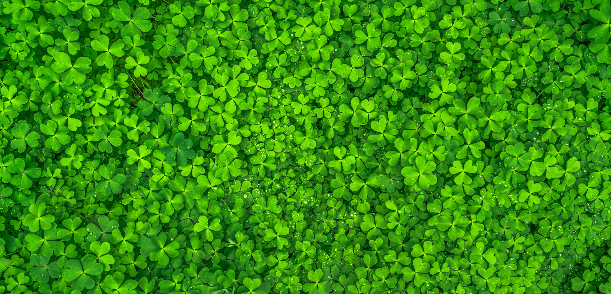
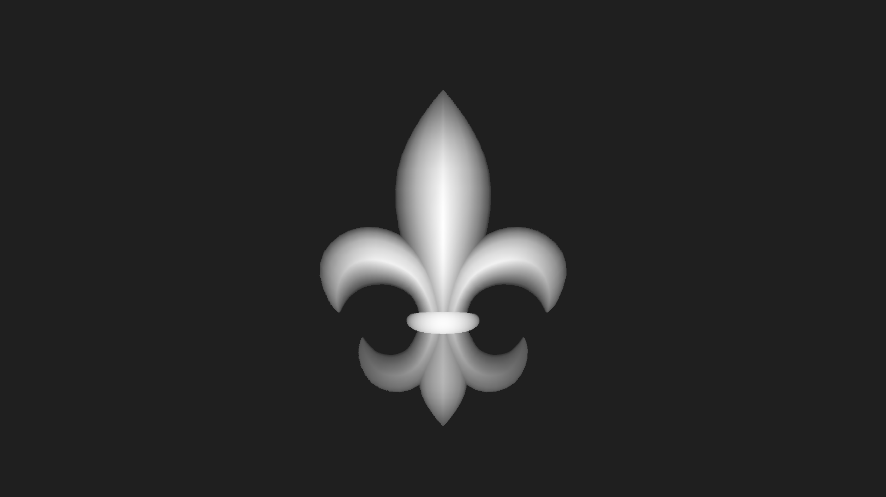
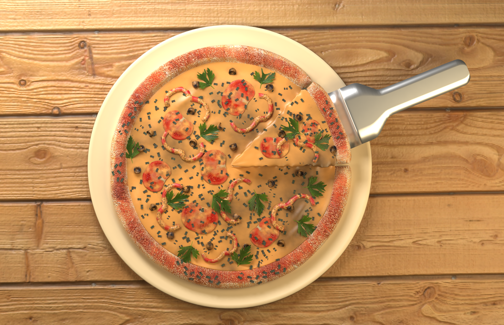
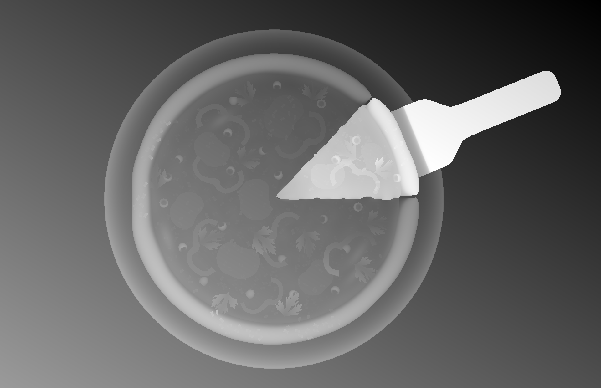

# Stereogram

[stereogram3.py](stereogram3.py) is a script to generate stereograms (Magic Eye images) using NumPy.

[index.html](index.html) is the beginning of an attempt to generate stereograms in real time in the browser using WebGL.

The starting point for my algorithm is this [Stereogram Tutorial](https://www.ime.usp.br/~otuyama/stereogram/basic/index.html) by [Julio M. Otuyama](https://www.ime.usp.br/~otuyama/).

Here's a traditional stereogram produced by an [earlier version](../../tree/8c7cf5818a3722aecf1bc0a3e3735e3d5d5cadc0) of the script:

If you unfocus your eyes as if you were looking into the distance, a 3D [fleur-de-lis](https://en.wikipedia.org/wiki/Fleur-de-lis) may appear to pop out of the image.
It may help to make the image smaller on your screen and lean closer to it.

The inputs to the script are this texture...

...and this depth map.

The [current version](../../tree/0e825047ab253d328d1df395447ae37748230267) of the script produces this image:

If you unfocus your eyes, you may see a 3D image of a pizza with one slice being lifted out of it by a metal serving utensil.

This stereogram is unusual in that it attempts to preserve the color and texture of the original 3D model that the depth map is based on.

The inputs to the script are this image...

...and this depth map.

In order to approximate the color and texture of the input image,
the script separates it into a low-frequency (color) component and a high-frequency (texture) component.

Copies of the texture component are added at regular intervals along the x-axis, getting fainter as the offset increases.
This repetition allows the stereogram effect to work.

The color component is not repeated at regular intervals.
Instead, the color component of the output image is chosen such that the average of what your left eye sees and what your right eye sees
is as close as possible to the color component of the input image.
